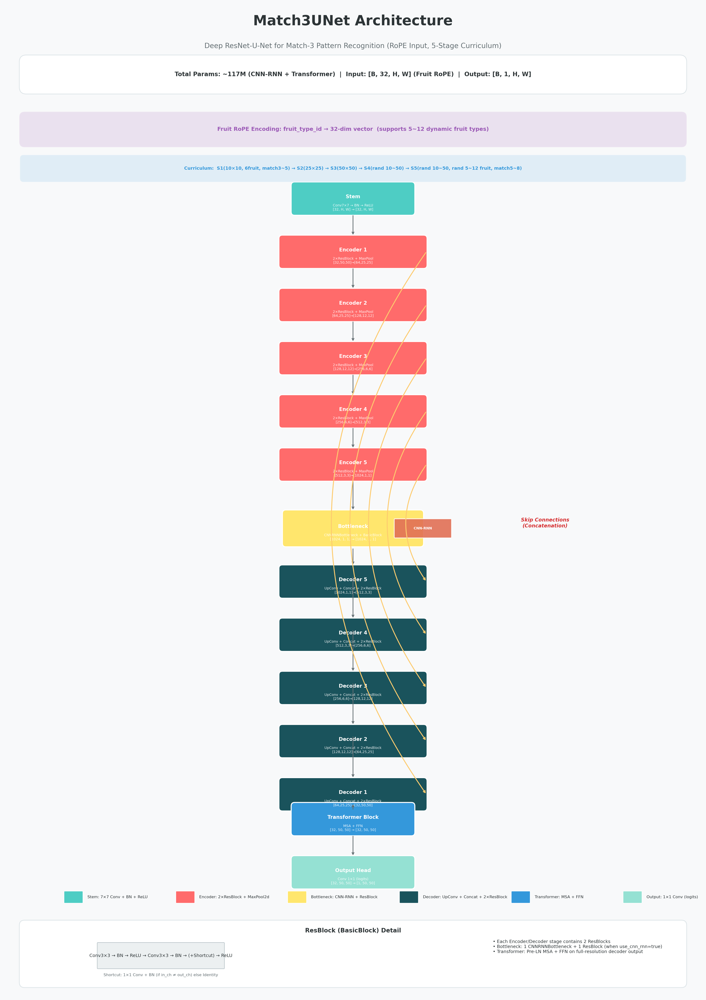

# Match-3 U-Net 模型 (50×50)

> 基于 CNN-RNN-Transformer U-Net 的三消（Match-3）Pattern 识别模型。

## 模型信息

| 项目 | 详情 |
|------|------|
| 架构 | CNN-RNN-Transformer U-Net (5层 Encoder + CNN-RNN Bottleneck + 5层 Decoder + Transformer Output) |
| 输入尺寸 | 50×50 棋盘 |
| 水果种类 | 6 种 |
| 参数量 | ~117M |
| 精度 | BF16 混合精度训练 |
| 输出 | 消除位置 Mask (logits) |
| CNN-RNN | Bottleneck 中 CNN + 双向 Row/Col GRU |
| Transformer | Decoder 末端 Pre-LN MSA + FFN |

## 模型架构



## 支持的 Pattern

- 横向/纵向 3/4/5 连 (H3~H5, V3~V5)
- L 型、T 型、十字型

## 使用方式

```python
import torch
from models.model import Match3UNet
from config import Match3Config

config = Match3Config()
config.dropout = 0.1
model = Match3UNet(config)

# 加载检查点
checkpoint = torch.load("match3_unet_epochbest.pt", map_location="cpu")
model.load_state_dict(checkpoint["model_state_dict"])
model.eval()
```

## 训练配置

- Batch size: 40 (Stage 1~2 使用 100)
- Dropout: 0.0
- 课程学习: 10×10 → 25×25 → 50×50
- 损失函数: Dice + Focal + Boundary

## 相关链接

- 代码仓库: https://github.com/Jup33Q/match3-cnn-trainer
