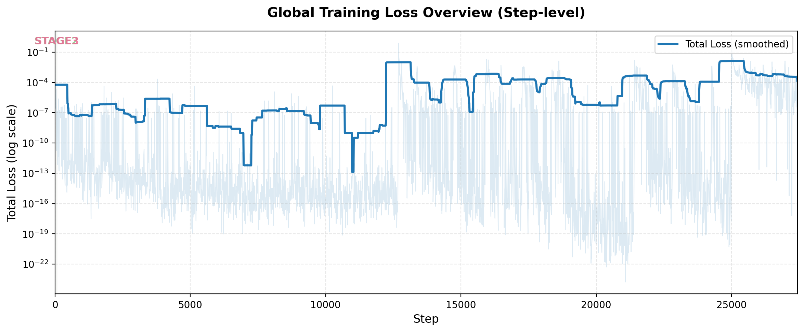
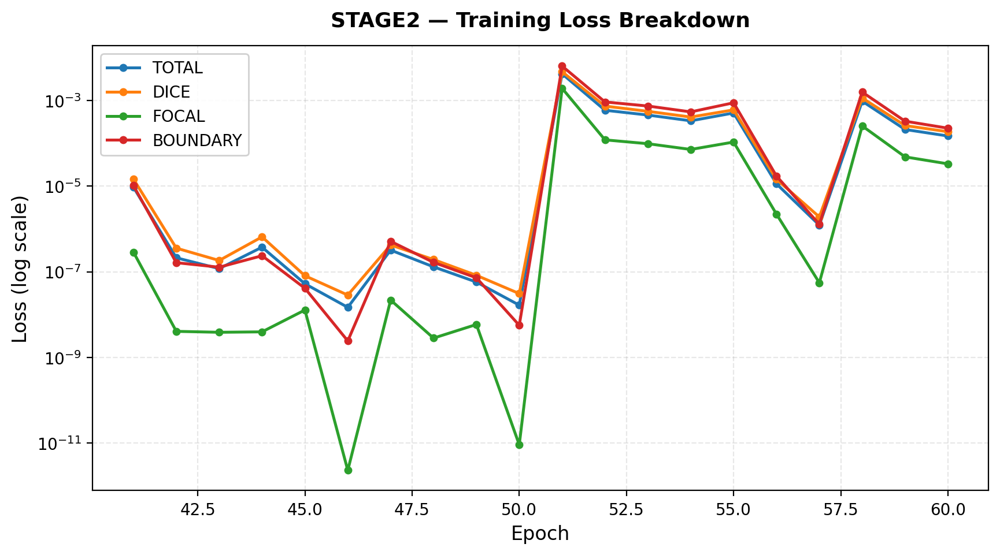
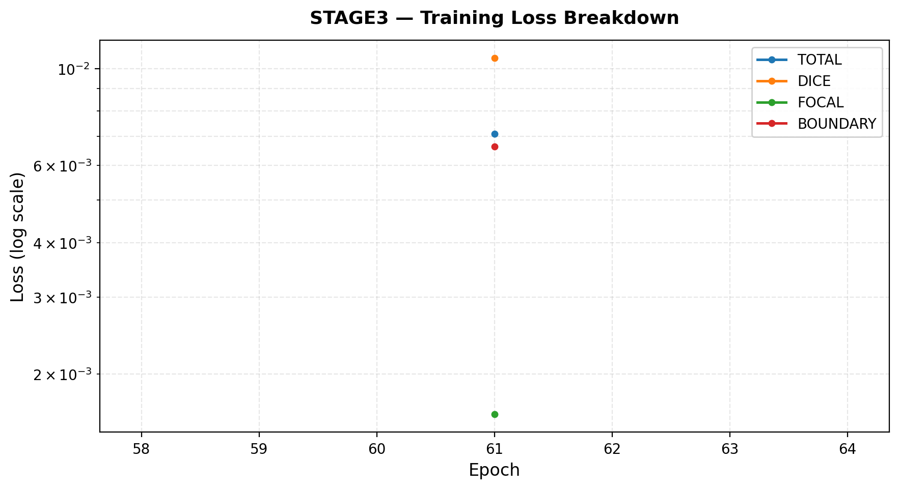
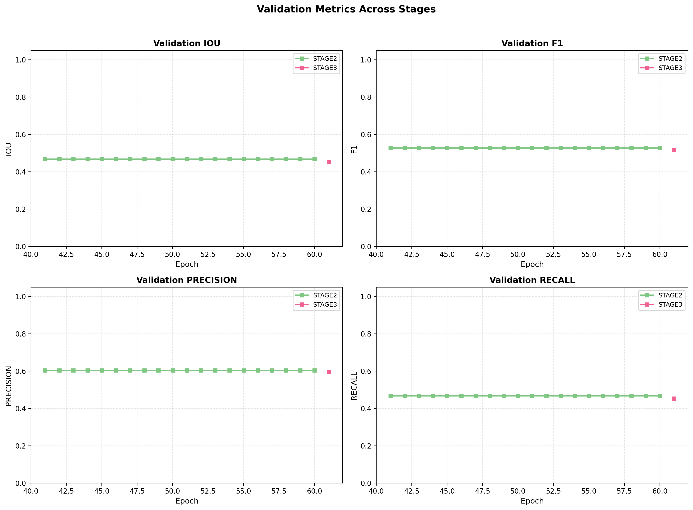
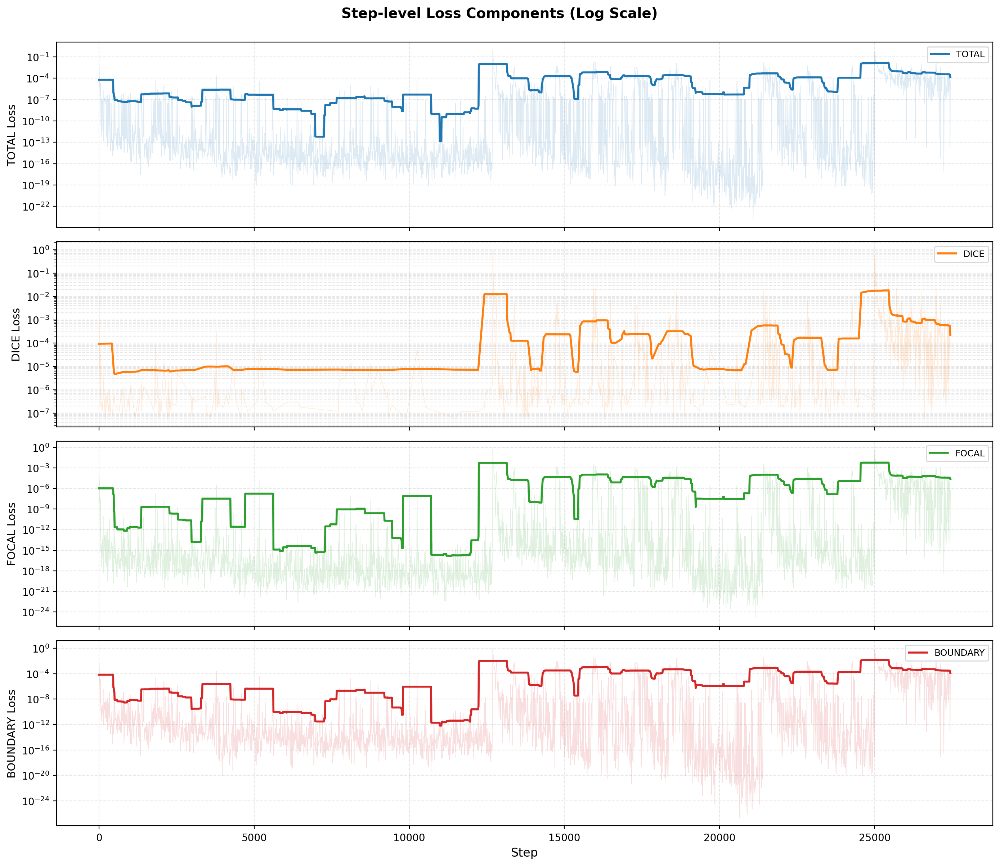
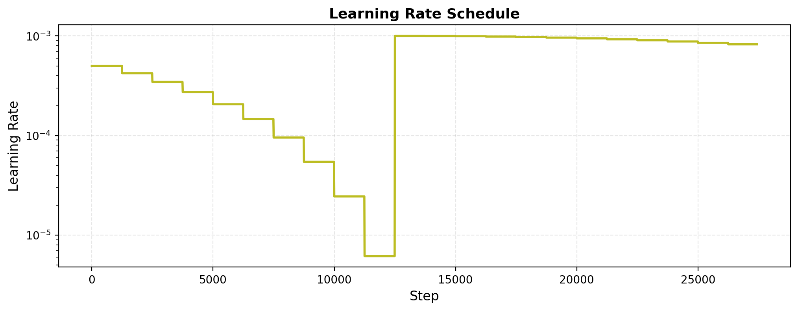
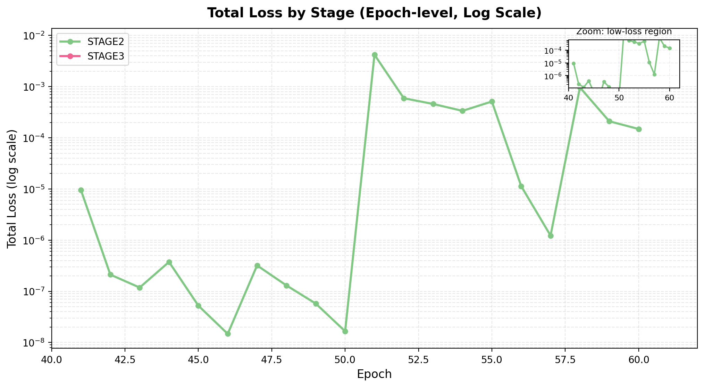

# 🎮 Match-3 CNN Trainer — 训练日志概览

- **导出时间**: 2026-05-28T17:44:13.334942
- **数据来源**: `logs/events.out.tfevents.1779954363.LAPTOP-97HQ1SCP.24355.0` (2,038,996 bytes)
- **课程学习阶段**: stage2, stage3

## 📊 Stage 级别训练指标（每 Epoch）

### STAGE2

#### 训练损失

| Epoch | boundary | dice | focal | total |
|------|------|------|------|------|
| 41 | 1.0286e-05 | 1.4635e-05 | 2.8740e-07 | 9.4610e-06 |
| 42 | 1.6288e-07 | 3.5610e-07 | 4.0520e-09 | 2.1184e-07 |
| 43 | 1.2776e-07 | 1.8339e-07 | 3.8529e-09 | 1.1840e-07 |
| 44 | 2.3669e-07 | 6.5274e-07 | 3.9461e-09 | 3.7489e-07 |
| 45 | 4.1163e-08 | 8.0633e-08 | 1.2770e-08 | 5.2380e-08 |
| 46 | 2.4226e-09 | 2.8515e-08 | 2.2920e-12 | 1.4743e-08 |
| 47 | 5.1325e-07 | 4.2200e-07 | 2.1802e-08 | 3.2019e-07 |
| 48 | 1.6551e-07 | 1.9279e-07 | 2.8171e-09 | 1.3034e-07 |
| 49 | 7.2257e-08 | 8.2588e-08 | 5.8569e-09 | 5.7503e-08 |
| 50 | 5.6101e-09 | 3.0899e-08 | 9.0757e-12 | 1.6574e-08 |
| 51 | 6.3746e-03 | 4.6971e-03 | 1.9263e-03 | 4.2013e-03 |
| 52 | 9.2671e-04 | 7.4195e-04 | 1.2053e-04 | 5.9248e-04 |
| 53 | 7.4413e-04 | 5.5945e-04 | 9.7982e-05 | 4.5795e-04 |
| 54 | 5.4301e-04 | 4.1120e-04 | 7.1959e-05 | 3.3579e-04 |
| 55 | 8.8504e-04 | 6.0556e-04 | 1.0712e-04 | 5.1192e-04 |
| 56 | 1.7182e-05 | 1.4452e-05 | 2.2184e-06 | 1.1328e-05 |
| 57 | 1.2813e-06 | 1.9069e-06 | 5.5244e-08 | 1.2263e-06 |
| 58 | 1.5748e-03 | 1.1456e-03 | 2.5475e-04 | 9.6419e-04 |
| 59 | 3.2911e-04 | 2.6041e-04 | 4.8270e-05 | 2.1051e-04 |
| 60 | 2.2576e-04 | 1.8685e-04 | 3.3151e-05 | 1.4852e-04 |

#### 验证指标

| Epoch | f1 | iou | precision | recall |
|------|------|------|------|------|
| 41 | 0.5273 | 0.4680 | 0.6038 | 0.4680 |
| 42 | 0.5273 | 0.4680 | 0.6038 | 0.4680 |
| 43 | 0.5273 | 0.4680 | 0.6038 | 0.4680 |
| 44 | 0.5273 | 0.4680 | 0.6038 | 0.4680 |
| 45 | 0.5273 | 0.4680 | 0.6038 | 0.4680 |
| 46 | 0.5273 | 0.4680 | 0.6038 | 0.4680 |
| 47 | 0.5273 | 0.4680 | 0.6038 | 0.4680 |
| 48 | 0.5273 | 0.4680 | 0.6038 | 0.4680 |
| 49 | 0.5273 | 0.4680 | 0.6038 | 0.4680 |
| 50 | 0.5273 | 0.4680 | 0.6038 | 0.4680 |
| 51 | 0.5273 | 0.4680 | 0.6038 | 0.4680 |
| 52 | 0.5273 | 0.4680 | 0.6038 | 0.4680 |
| 53 | 0.5273 | 0.4680 | 0.6038 | 0.4680 |
| 54 | 0.5273 | 0.4680 | 0.6038 | 0.4680 |
| 55 | 0.5273 | 0.4680 | 0.6038 | 0.4680 |
| 56 | 0.5273 | 0.4680 | 0.6038 | 0.4680 |
| 57 | 0.5273 | 0.4680 | 0.6038 | 0.4680 |
| 58 | 0.5273 | 0.4680 | 0.6038 | 0.4680 |
| 59 | 0.5273 | 0.4680 | 0.6038 | 0.4680 |
| 60 | 0.5273 | 0.4680 | 0.6038 | 0.4680 |

### STAGE3

#### 训练损失

| Epoch | boundary | dice | focal | total |
|------|------|------|------|------|
| 61 | 6.6343e-03 | 1.0558e-02 | 1.6186e-03 | 7.0915e-03 |
| 62 | 3.9079e-04 | 7.2558e-04 | 6.4169e-05 | 4.6020e-04 |
| 63 | 5.8724e-04 | 1.0498e-03 | 9.2743e-05 | 6.7018e-04 |

#### 验证指标

| Epoch | f1 | iou | precision | recall |
|------|------|------|------|------|
| 61 | 0.5165 | 0.4543 | 0.5983 | 0.4544 |
| 62 | 0.5132 | 0.4518 | 0.5939 | 0.4519 |
| 63 | 0.5100 | 0.4488 | 0.5905 | 0.4488 |

## 🔬 Step 级别训练损失（采样）

以下展示每个 step 的原始损失值（科学计数法），便于观察训练动态：

### TOTAL Loss

| Step | Value |
|------|-------|
| 0 | 5.4152e-03 |
| 1470 | 4.8048e-14 |
| 2940 | 3.6625e-14 |
| 4410 | 6.9379e-15 |
| 5880 | 1.3481e-15 |
| 7350 | 2.1299e-16 |
| 8820 | 3.4745e-16 |
| 10290 | 1.5238e-15 |
| 11760 | 8.0976e-15 |
| 13230 | 1.1973e-07 |
| 14700 | 1.8113e-07 |
| 16170 | 2.6929e-07 |
| 17640 | 1.9134e-12 |
| 19110 | 2.1094e-07 |
| 20580 | 3.1327e-06 |
| 22050 | 1.1973e-07 |
| 23520 | 9.1856e-18 |
| 24990 | 1.7560e-18 |
| 26460 | 2.6880e-07 |
| 27930 | 1.2925e-04 |
| 29400 | 2.0896e-07 |

### DICE Loss

| Step | Value |
|------|-------|
| 0 | 8.2757e-03 |
| 1470 | 0.0000e+00 |
| 2940 | 0.0000e+00 |
| 4410 | 0.0000e+00 |
| 5880 | 0.0000e+00 |
| 7350 | 0.0000e+00 |
| 8820 | 0.0000e+00 |
| 10290 | 0.0000e+00 |
| 11760 | 0.0000e+00 |
| 13230 | 2.3842e-07 |
| 14700 | 3.5763e-07 |
| 16170 | 5.3644e-07 |
| 17640 | 0.0000e+00 |
| 19110 | 4.1723e-07 |
| 20580 | 5.6624e-06 |
| 22050 | 2.3842e-07 |
| 23520 | 0.0000e+00 |
| 24990 | 0.0000e+00 |
| 26460 | 5.3644e-07 |
| 27930 | 2.0498e-04 |
| 29400 | 4.1723e-07 |

### FOCAL Loss

| Step | Value |
|------|-------|
| 0 | 8.3825e-05 |
| 1470 | 1.0967e-19 |
| 2940 | 3.6994e-17 |
| 4410 | 3.7747e-18 |
| 5880 | 3.8682e-20 |
| 7350 | 2.4659e-19 |
| 8820 | 1.0784e-19 |
| 10290 | 4.8073e-16 |
| 11760 | 4.5539e-21 |
| 13230 | 1.1836e-13 |
| 14700 | 2.3022e-12 |
| 16170 | 2.6569e-13 |
| 17640 | 1.1356e-15 |
| 19110 | 6.8580e-13 |
| 20580 | 1.6102e-09 |
| 22050 | 1.0633e-13 |
| 23520 | 2.9563e-17 |
| 24990 | 3.4015e-19 |
| 26460 | 8.8570e-14 |
| 27930 | 1.7718e-06 |
| 29400 | 8.8018e-14 |

### BOUNDARY Loss

| Step | Value |
|------|-------|
| 0 | 6.2610e-03 |
| 1470 | 2.4024e-13 |
| 2940 | 1.8307e-13 |
| 4410 | 3.4684e-14 |
| 5880 | 6.7404e-15 |
| 7350 | 1.0646e-15 |
| 8820 | 1.7371e-15 |
| 10290 | 6.8979e-15 |
| 11760 | 4.0488e-14 |
| 13230 | 2.5940e-09 |
| 14700 | 1.1597e-08 |
| 16170 | 5.3407e-09 |
| 17640 | 9.5654e-12 |
| 19110 | 1.1597e-08 |
| 20580 | 1.5051e-06 |
| 22050 | 2.6077e-09 |
| 23520 | 1.5838e-18 |
| 24990 | 8.2699e-18 |
| 26460 | 2.9147e-09 |
| 27930 | 1.3117e-04 |
| 29400 | 1.6962e-09 |

## 💾 显存/内存监控

- **gpu_allocated_mb**: 最新=3059.4, 峰值=3060.9
- **gpu_reserved_mb**: 最新=4942.0, 峰值=5026.0
- **gpu_max_allocated_mb**: 最新=4288.7, 峰值=4288.7
- **gpu_max_reserved_mb**: 最新=5026.0, 峰值=5026.0
- **sys_percent**: 最新=25.7, 峰值=29.1
- **process_rss_mb**: 最新=2200.8, 峰值=2484.1

## 📝 关键趋势

- **STAGE2** 训练 Total Loss: 9.4610e-06 → 1.4852e-04 (变化比: 15.70x)
- **STAGE2** 验证 IoU: 0.4680 → 0.4680 (变化: +0.0000)
- **STAGE3** 训练 Total Loss: 7.0915e-03 → 6.7018e-04 (变化比: 0.09x)
- **STAGE3** 验证 IoU: 0.4543 → 0.4488 (变化: -0.0056)

## 📈 训练曲线图

以下图表由 `scripts/plot_training_curves.py` 自动生成，保存在 `logs/training_curves/`：

| 图表 | 说明 |
|------|------|
|  | 全局 Step 级 Total Loss（log y，stage 背景色带） |
|  | STAGE2 训练损失分解（log y） |
|  | STAGE3 训练损失分解（log y） |
|  | 验证指标四宫格（线性 y） |
|  | Step 级损失分面图（log y） |
|  | 学习率变化曲线 |
|  | 合并 epoch 级总损失 + 低损失 zoom |

---
*自动生成于 2026-05-28T17:44:13.334942*