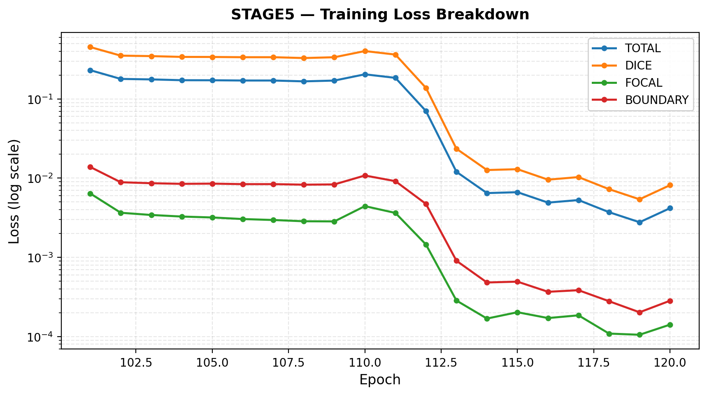

# 🎮 Match-3 CNN Trainer — 训练日志概览

- **导出时间**: 2026-05-29T08:52:30.389177
- **数据来源**: `logs/events.out.tfevents.1779954363.LAPTOP-97HQ1SCP.24355.0` (2,158,212 bytes)
- **课程学习阶段**: stage2, stage3, stage5

## 📊 Stage 级别训练指标（每 Epoch）

### STAGE2

#### 训练损失

| Epoch | boundary | dice | focal | total |
|------|------|------|------|------|
| 41 | 1.0286e-05 | 1.4635e-05 | 2.8740e-07 | 9.4610e-06 |
| 42 | 1.6288e-07 | 3.5610e-07 | 4.0520e-09 | 2.1184e-07 |
| 43 | 1.2776e-07 | 1.8339e-07 | 3.8529e-09 | 1.1840e-07 |
| 44 | 2.3669e-07 | 6.5274e-07 | 3.9461e-09 | 3.7489e-07 |
| 45 | 4.1163e-08 | 8.0633e-08 | 1.2770e-08 | 5.2380e-08 |
| 46 | 2.4226e-09 | 2.8515e-08 | 2.2920e-12 | 1.4743e-08 |
| 47 | 5.1325e-07 | 4.2200e-07 | 2.1802e-08 | 3.2019e-07 |
| 48 | 1.6551e-07 | 1.9279e-07 | 2.8171e-09 | 1.3034e-07 |
| 49 | 7.2257e-08 | 8.2588e-08 | 5.8569e-09 | 5.7503e-08 |
| 50 | 5.6101e-09 | 3.0899e-08 | 9.0757e-12 | 1.6574e-08 |
| 51 | 6.3746e-03 | 4.6971e-03 | 1.9263e-03 | 4.2013e-03 |
| 52 | 9.2671e-04 | 7.4195e-04 | 1.2053e-04 | 5.9248e-04 |
| 53 | 7.4413e-04 | 5.5945e-04 | 9.7982e-05 | 4.5795e-04 |
| 54 | 5.4301e-04 | 4.1120e-04 | 7.1959e-05 | 3.3579e-04 |
| 55 | 8.8504e-04 | 6.0556e-04 | 1.0712e-04 | 5.1192e-04 |
| 56 | 1.7182e-05 | 1.4452e-05 | 2.2184e-06 | 1.1328e-05 |
| 57 | 1.2813e-06 | 1.9069e-06 | 5.5244e-08 | 1.2263e-06 |
| 58 | 1.5748e-03 | 1.1456e-03 | 2.5475e-04 | 9.6419e-04 |
| 59 | 3.2911e-04 | 2.6041e-04 | 4.8270e-05 | 2.1051e-04 |
| 60 | 2.2576e-04 | 1.8685e-04 | 3.3151e-05 | 1.4852e-04 |

#### 验证指标

| Epoch | f1 | iou | precision | recall |
|------|------|------|------|------|
| 41 | 0.5273 | 0.4680 | 0.6038 | 0.4680 |
| 42 | 0.5273 | 0.4680 | 0.6038 | 0.4680 |
| 43 | 0.5273 | 0.4680 | 0.6038 | 0.4680 |
| 44 | 0.5273 | 0.4680 | 0.6038 | 0.4680 |
| 45 | 0.5273 | 0.4680 | 0.6038 | 0.4680 |
| 46 | 0.5273 | 0.4680 | 0.6038 | 0.4680 |
| 47 | 0.5273 | 0.4680 | 0.6038 | 0.4680 |
| 48 | 0.5273 | 0.4680 | 0.6038 | 0.4680 |
| 49 | 0.5273 | 0.4680 | 0.6038 | 0.4680 |
| 50 | 0.5273 | 0.4680 | 0.6038 | 0.4680 |
| 51 | 0.5273 | 0.4680 | 0.6038 | 0.4680 |
| 52 | 0.5273 | 0.4680 | 0.6038 | 0.4680 |
| 53 | 0.5273 | 0.4680 | 0.6038 | 0.4680 |
| 54 | 0.5273 | 0.4680 | 0.6038 | 0.4680 |
| 55 | 0.5273 | 0.4680 | 0.6038 | 0.4680 |
| 56 | 0.5273 | 0.4680 | 0.6038 | 0.4680 |
| 57 | 0.5273 | 0.4680 | 0.6038 | 0.4680 |
| 58 | 0.5273 | 0.4680 | 0.6038 | 0.4680 |
| 59 | 0.5273 | 0.4680 | 0.6038 | 0.4680 |
| 60 | 0.5273 | 0.4680 | 0.6038 | 0.4680 |

### STAGE3

#### 训练损失

| Epoch | boundary | dice | focal | total |
|------|------|------|------|------|
| 61 | 6.6343e-03 | 1.0558e-02 | 1.6186e-03 | 7.0915e-03 |
| 62 | 3.9079e-04 | 7.2558e-04 | 6.4169e-05 | 4.6020e-04 |
| 63 | 5.8724e-04 | 1.0498e-03 | 9.2743e-05 | 6.7018e-04 |
| 64 | 1.2452e-04 | 2.3908e-04 | 2.4830e-05 | 1.5189e-04 |
| 65 | 4.2072e-04 | 7.3888e-04 | 8.4307e-05 | 4.7888e-04 |

#### 验证指标

| Epoch | f1 | iou | precision | recall |
|------|------|------|------|------|
| 61 | 0.5165 | 0.4543 | 0.5983 | 0.4544 |
| 62 | 0.5132 | 0.4518 | 0.5939 | 0.4519 |
| 63 | 0.5100 | 0.4488 | 0.5905 | 0.4488 |
| 64 | 0.5189 | 0.4583 | 0.5980 | 0.4583 |
| 65 | 0.5134 | 0.4520 | 0.5940 | 0.4520 |

### STAGE5

#### 训练损失

| Epoch | boundary | dice | focal | total |
|------|------|------|------|------|
| 101 | 1.3845e-02 | 4.5239e-01 | 6.4073e-03 | 2.3089e-01 |
| 102 | 8.8740e-03 | 3.5233e-01 | 3.6538e-03 | 1.7903e-01 |
| 103 | 8.6254e-03 | 3.4751e-01 | 3.4258e-03 | 1.7651e-01 |
| 104 | 8.4699e-03 | 3.3955e-01 | 3.2728e-03 | 1.7245e-01 |
| 105 | 8.5215e-03 | 3.3903e-01 | 3.1860e-03 | 1.7218e-01 |
| 106 | 8.3989e-03 | 3.3662e-01 | 3.0427e-03 | 1.7090e-01 |
| 107 | 8.4019e-03 | 3.3661e-01 | 2.9606e-03 | 1.7087e-01 |
| 108 | 8.2682e-03 | 3.2854e-01 | 2.8529e-03 | 1.6678e-01 |
| 109 | 8.3306e-03 | 3.3631e-01 | 2.8412e-03 | 1.7067e-01 |
| 110 | 1.0793e-02 | 4.0237e-01 | 4.4302e-03 | 2.0467e-01 |
| 111 | 9.1572e-03 | 3.6347e-01 | 3.6352e-03 | 1.8466e-01 |
| 112 | 4.7318e-03 | 1.3814e-01 | 1.4531e-03 | 7.0454e-02 |
| 113 | 9.0471e-04 | 2.3499e-02 | 2.8458e-04 | 1.2016e-02 |
| 114 | 4.8108e-04 | 1.2654e-02 | 1.6850e-04 | 6.4740e-03 |
| 115 | 4.9307e-04 | 1.2972e-02 | 2.0265e-04 | 6.6453e-03 |
| 116 | 3.6707e-04 | 9.5679e-03 | 1.7102e-04 | 4.9087e-03 |
| 117 | 3.8422e-04 | 1.0308e-02 | 1.8513e-04 | 5.2863e-03 |
| 118 | 2.7897e-04 | 7.2566e-03 | 1.0886e-04 | 3.7168e-03 |
| 119 | 2.0232e-04 | 5.4040e-03 | 1.0521e-04 | 2.7740e-03 |
| 120 | 2.8317e-04 | 8.1530e-03 | 1.4133e-04 | 4.1756e-03 |

#### 验证指标

| Epoch | f1 | iou | precision | recall |
|------|------|------|------|------|
| 101 | 0.2194 | 0.1810 | 0.2764 | 0.1819 |
| 102 | 0.2168 | 0.1812 | 0.2679 | 0.1821 |
| 103 | 0.2328 | 0.1940 | 0.2897 | 0.1945 |
| 104 | 0.2278 | 0.1905 | 0.2824 | 0.1908 |
| 105 | 0.2167 | 0.1802 | 0.2718 | 0.1802 |
| 106 | 0.2260 | 0.1888 | 0.2813 | 0.1889 |
| 107 | 0.2284 | 0.1916 | 0.2826 | 0.1917 |
| 108 | 0.2213 | 0.1855 | 0.2742 | 0.1855 |
| 109 | 0.2260 | 0.1888 | 0.2815 | 0.1888 |
| 110 | 0.2181 | 0.1818 | 0.2721 | 0.1820 |
| 111 | 0.2156 | 0.1816 | 0.2645 | 0.1819 |
| 112 | 0.3782 | 0.3711 | 0.3824 | 0.3740 |
| 113 | 0.3756 | 0.3700 | 0.3784 | 0.3728 |
| 114 | 0.3718 | 0.3663 | 0.3768 | 0.3670 |
| 115 | 0.3538 | 0.3483 | 0.3592 | 0.3486 |
| 116 | 0.3759 | 0.3689 | 0.3831 | 0.3691 |
| 117 | 0.3639 | 0.3610 | 0.3666 | 0.3612 |
| 118 | 0.3668 | 0.3633 | 0.3701 | 0.3637 |
| 119 | 0.3870 | 0.3841 | 0.3897 | 0.3844 |
| 120 | 0.3787 | 0.3750 | 0.3820 | 0.3754 |

## 🔬 Step 级别训练损失（采样）

以下展示每个 step 的原始损失值（科学计数法），便于观察训练动态：

### TOTAL Loss

| Step | Value |
|------|-------|
| 0 | 8.7666e-01 |
| 1250 | 1.9285e-01 |
| 2500 | 2.8635e-01 |
| 3750 | 2.5318e-01 |
| 5000 | 1.5935e-01 |
| 6250 | 1.5375e-01 |
| 7500 | 1.0024e-01 |
| 8750 | 1.4968e-01 |
| 10000 | 1.6215e-01 |
| 11250 | 1.3171e-01 |
| 12500 | 2.0304e-01 |
| 13750 | 2.0213e-01 |
| 15000 | 8.2600e-03 |
| 16250 | 3.3293e-03 |
| 17500 | 6.3967e-03 |
| 18750 | 1.3814e-02 |
| 20000 | 1.5256e-02 |
| 21250 | 1.1628e-03 |
| 22500 | 2.1170e-02 |
| 23750 | 1.1277e-02 |

### DICE Loss

| Step | Value |
|------|-------|
| 0 | 9.5970e-01 |
| 1250 | 3.8012e-01 |
| 2500 | 5.6497e-01 |
| 3750 | 4.9727e-01 |
| 5000 | 3.1421e-01 |
| 6250 | 3.0548e-01 |
| 7500 | 1.9794e-01 |
| 8750 | 2.9661e-01 |
| 10000 | 3.2137e-01 |
| 11250 | 2.6024e-01 |
| 12500 | 3.9858e-01 |
| 13750 | 4.0047e-01 |
| 15000 | 1.6308e-02 |
| 16250 | 6.4353e-03 |
| 17500 | 1.2630e-02 |
| 18750 | 2.6812e-02 |
| 20000 | 2.9802e-02 |
| 21250 | 2.2936e-03 |
| 22500 | 4.1392e-02 |
| 23750 | 2.2076e-02 |

### FOCAL Loss

| Step | Value |
|------|-------|
| 0 | 5.3556e-01 |
| 1250 | 3.7302e-03 |
| 2500 | 4.6859e-03 |
| 3750 | 5.6985e-03 |
| 5000 | 2.7731e-03 |
| 6250 | 1.0862e-03 |
| 7500 | 1.4654e-03 |
| 8750 | 1.5592e-03 |
| 10000 | 1.6528e-03 |
| 11250 | 1.8149e-03 |
| 12500 | 4.6203e-03 |
| 13750 | 2.1361e-03 |
| 15000 | 6.7358e-05 |
| 16250 | 5.0124e-05 |
| 17500 | 2.6248e-05 |
| 18750 | 5.3692e-04 |
| 20000 | 7.5687e-04 |
| 21250 | 2.6718e-05 |
| 22500 | 4.7706e-04 |
| 23750 | 3.7852e-04 |

### BOUNDARY Loss

| Step | Value |
|------|-------|
| 0 | 1.1807e+00 |
| 1250 | 8.3321e-03 |
| 2500 | 1.2268e-02 |
| 3750 | 1.4170e-02 |
| 5000 | 7.0711e-03 |
| 6250 | 3.4162e-03 |
| 7500 | 4.1674e-03 |
| 8750 | 4.5592e-03 |
| 10000 | 4.8580e-03 |
| 11250 | 5.2192e-03 |
| 12500 | 1.1853e-02 |
| 13750 | 6.2915e-03 |
| 15000 | 4.2817e-04 |
| 16250 | 4.8304e-04 |
| 17500 | 3.7044e-04 |
| 18750 | 1.2342e-03 |
| 20000 | 6.4000e-04 |
| 21250 | 4.0000e-05 |
| 22500 | 1.6537e-03 |
| 23750 | 6.2813e-04 |

## 💾 显存/内存监控

- **gpu_allocated_mb**: 最新=3059.4, 峰值=3060.9
- **gpu_reserved_mb**: 最新=4940.0, 峰值=5026.0
- **gpu_max_allocated_mb**: 最新=4288.7, 峰值=4288.7
- **gpu_max_reserved_mb**: 最新=5026.0, 峰值=5026.0
- **sys_percent**: 最新=29.8, 峰值=29.9
- **process_rss_mb**: 最新=2152.7, 峰值=2185.3

## 📝 关键趋势

- **STAGE2** 训练 Total Loss: 9.4610e-06 → 1.4852e-04 (变化比: 15.70x)
- **STAGE2** 验证 IoU: 0.4680 → 0.4680 (变化: +0.0000)
- **STAGE3** 训练 Total Loss: 7.0915e-03 → 4.7888e-04 (变化比: 0.07x)
- **STAGE3** 验证 IoU: 0.4543 → 0.4520 (变化: -0.0024)
- **STAGE5** 训练 Total Loss: 2.3089e-01 → 4.1756e-03 (变化比: 0.02x)
- **STAGE5** 验证 IoU: 0.1810 → 0.3750 (变化: +0.1941)

## 📈 训练曲线图

以下图表由 `scripts/plot_training_curves.py` 自动生成，保存在 `logs/training_curves/`：

| 图表 | 说明 |
|------|------|
|  | 全局 Step 级 Total Loss（log y，stage 背景色带） |
|  | STAGE2 训练损失分解（log y） |
|  | STAGE3 训练损失分解（log y） |
|  | STAGE5 训练损失分解（log y） |
|  | 验证指标四宫格（线性 y） |
|  | Step 级损失分面图（log y） |
|  | 学习率变化曲线 |
|  | 合并 epoch 级总损失 + 低损失 zoom |

---
*自动生成于 2026-05-29T08:52:30.389177*